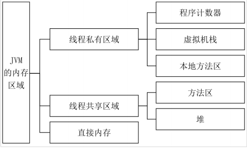
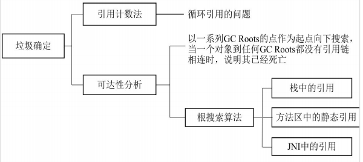
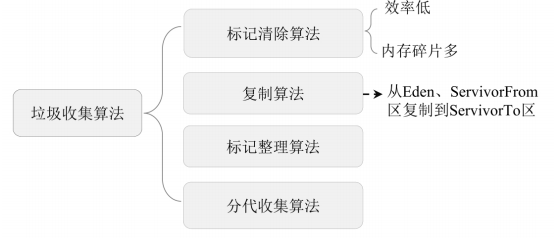
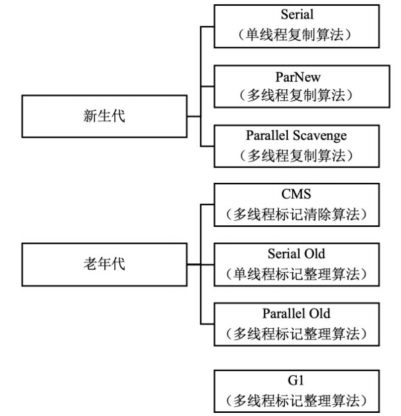

## JVM概述

**什么是JVM？**

- JVM（Java Virtual Machine）是用于运行Java字节码的虚拟机，是java跨平台的基石。

**Java程序的执行过程**

1. 将Java源文件编译成.class字节码文件
2. 将字节码文件编译成相应操作系统的机器码
3. 机器码调用相应操作系统的本地方法库执行相应的方法

## JVM的体系结构

**Java虚拟机包括类加载子系统、运行时数据区、执行引擎和本地接口库**

- 类加载子系统：将编译好的.Class文件加载到JVM中
- 运行时数据区：存储在JVM运行过程中产生的数据
- 执行引擎：将Java字节码编译成具体的机器码；基于系统的运行情况启动垃圾回收
- 本地接口库：调用操作系统的本地方法库完成具体的指令操作

**JVM的类加载分为5个阶段：加载、验证、准备、解析、初始化**

- 加载：将class文件读取到方法区，并在堆中创建class对象

- 验证：确保class文件符合当前虚拟机的要求

- 准备：为类变量分配内存空间、设置初始值；final修饰静态变量的=赋值操作在该阶段完成

- 解析：将常量池中的符号引用替换为直接引用

- 初始化：基于静态代码块、静态变量的赋值操作对类进行初始化；普通静态变量的=赋值操作在该阶段完成

**JVM提供了3种类加载器：启动类加载器、扩展类加载器、应用程序类加载器**

- 启动类加载器：加载Java_HOME/lib目录中的类库，-Xbootclasspath指定路径中被虚拟机认可的类库
- 扩展类加载器：加载Java_HOME/lib/ext目录中的类库；java.ext.dirs系统变量加载指定路径中的类库
- 应用程序类加载器：加载用户路径（classpath）上的类库

<!--自定义类加载器：我们也可以通过继承 java.lang.ClassLoader自定义类加载器-->

**类加载机制：双亲委派机制**

- 一个类在收到类加载请求时，将该请求一层层向上委派给父类去加载，父类不能加载自身再进行；即自定义加载器-应用程序类加载器-扩展类加载器-启动类加载器，若父类不能加载再向下委派；以加载Object类为例，无论哪个类加载器加载该类，最终都会将请求委托给启动类加载器，从而保证了类加载的唯一性

## JVM的内存模型

**JVM的内存区域分为线程私有区域、线程共享区域和直接内存**

- 线程私有区属于线程，生命周期与线程相同，随线程的启动而创建，随线程的结束而销毁，包括程序计数器、虚拟机栈和本地方法栈。
  - 程序计数器：存储当前运行的线程所执行的字节码的行号指示器，是唯一没有Out Of Memory（内存溢出）的区域
  - 虚拟机栈：描述Java方法的执行过程，通过栈帧用来记录方法的执行过程，方法的执行和返回对应了栈帧的入栈和出栈
  - 本地方法栈：与虚拟机栈类似，只是本地方法栈为Native方法服务
- 线程共享区属于JVM，随虚拟机的启动而创建，随虚拟机的关闭而销毁，包括方法区和堆区
  - 方法区：存储常量、静态变量、类信息、编译后的机器码、运行时常量池等
  - 堆区：存储新创建的对象，垃圾收集器进行垃圾回收的最主要的内存区域
- 直接内存也叫堆外内存，属于操作系统，基于该技术可以避免在Java堆和Native堆中来回复制数据带来的资源占用和性能消耗，在并发编程中被频繁使用，如Java中的NIO模块

## JVM堆区详解

**从GC的角度可以将JVM堆分为新生代、老年代和永久代**

- 新生代：新生代默认占 1/3堆空间；新创建的对象（大对象除外）会被存放在新生代；新生代的GC过程叫作MinorGC，采用复制算法实现；可通过如下命令定义大对象的大小：`-XX:PretenureSizeThreshold`
- 老年代：老年代默认占 2/3堆空间；存放有长生命周期的对象和大对象；老年代的GC过程叫作MajorGC，采用标记清除算法实现

- 永久代：存放Class和Meta（元数据）信息；在Java 8中永久代被元数据区（也叫作元空间）取代；永久代使用JVM的内存，而元数据区直接使用操作系统的本地内存

**新生代又进一步分为Eden区、ServivorFrom区和ServivorTo区**

- Eden区：Eden区默认占8/10新生代空间；存放新创建的对象（大对象除外）；Eden区的内存空间不足时会触发MinorGC
- ServivorFrom区：ServivorFrom区默认占 1/10新生代空间；将上一次MinorGC时的幸存者作为这一次MinorGC的被扫描者
- ServivorTo区：ServivorTo区默认占 1/10新生代空间；保留上一次MinorGC时的幸存者

## JVM垃圾回收

**Java采用引用计数法、可达性分析来确定对象是否为该被回收**

- 引用计数法：为对象添加引用时引用计数加1，为对象删除引用时，引用计数减1，当引用计数为0时，对象可以被回收；易产生循环引用，即两个对象相互引用，导致引用一直存在而无法被回收
- 可达性分析：以GC Roots对象为起点向下搜索，若一个对象到任意GC Roots之间没有可达路径，则该对象可以被回收

**Java中GC Roots对象**

- 虚拟机栈中的引用的对象
- 方法区中的类静态属性引用的对象
- 方法区中的常量引用的对象
- 本地方法栈中的JNI（native方法）引用的对象

## GC算法

**Java新生代复制算法的实现过程**

1. 把 在 Eden 区 和 ServivorFrom 区 中 存 活 的 对 象 复 制 到ServivorTo区
2. 清空Eden区和ServivorFrom区中的对象
3. 将ServivorTo区和ServivorFrom区互换

**Java老年代标记清除算法实现过程**

1. 扫描所有对象并标记存活的对象
2. 回收未被标记的对象，并释放内存空间

**Java中常用的垃圾回收算法：标记清除、复制、标记整理、分代收集**

- 标记清除：分为标记和清除两个阶段；清除后未进行内存整理，存在内存碎片化的问题

- 复制：将内存分为区域A和区域B，将区域A中经过标记后仍然存活的对象复制到区域B，再清除区域A；同一时刻只有一个内存区域可用，存在内存浪费；若存在大量长期存活的对象，区域A和B之间来回复制存在性能损耗
- 标记整理：标记阶段和标记清除相同，在标记完成后将存活的对象移到内存的另一端，再清除该端的对象
- 分代收集：根据对象存活周期的不同将内存划分为新生代、老年代和永久代，并根据各年代的特点分别采用不同的GC算法

## GC垃圾收集器

**Java中常见的垃圾收集器：Serial垃圾收集器、ParNew垃圾收集器、Parallel Scavenge垃圾收集器、Serial Old垃圾收集器、Parallel Old垃圾收集器、CMS垃圾收集器、G1垃圾收集器**

- Serial垃圾收集器：单线程，复制算法；Client模式下的新生代的默认垃圾收集器

- ParNew垃圾收集器：多线程，复制算法；Server模式下的新生代的默认垃圾收集器；可通过`-XX:ParallelGCThreads`调节工作线程数

- Parallel Scavenge垃圾收集器：多线程，复制算法；通过`-XX:MaxGCPauseMillis`参数控制最大垃圾收集停顿时间；通过`-XX:GCTimeRatio`控制吞吐量大小；通过`UseAdaptiveSizePolicy`参数控制自适应调节策略开启与否
- Serial Old垃圾收集器：单线程，标记整理算法；Client模式下的老年代的默认垃圾收集器
- CMS垃圾收集器：多线程，标记清除算法；Server模式下的老年代的默认垃圾收集器
- Parallel Old垃圾收集器：多线程，标记整理算法
- G1垃圾收集器：通过内存区域独立划分使用、根据不同优先级回收各区域垃圾

