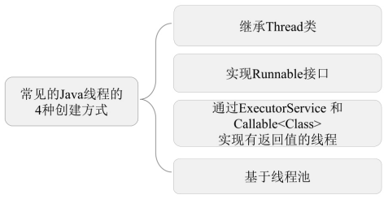

## Java线程的创建方式

- Java线程的四种创建方式：继承Thread类、实现Runnable接口、实现Callable接口、基于线程池
  - 继承Thread类：自定义类实现Thread类，重写run方法，实例化线程对象调用start方法启动线程
  - 实现Runnable接口：自定义类实现Runnable接口，重写run方法，实例化线程对象传入Runnable接口实现类对象，调用线程对象的start方法启动线程
  - 实现Callable接口：自定义类实现Callable接口，重写call方法，实例化线程池对象，提交线程任务并返回一个Future对象，通过get方法后去执行结果
  - 基于线程池：实例化线程池对象，提交线程任务并接收返回值

## Java线程的生命周期

- Java线程的生命周期包括5种状态：新建（New）、就绪（Runnable）、运行 （Running）、阻塞（Blocked）和死亡（Dead）
  - 新建：新创建的线程处于新建状态
  - 就绪：新建的线程对象在调用start方法之后将转为就绪状态
  - 运行：就绪状态的线程在竞争到CPU的使用权并开始执行run方法时会转为运行状态
  - 阻塞：运行中的线程主动或被动地放弃CPU的使用权并暂停运行，该线程将转为阻塞状态
  - 死亡：线程正常结束、异常退出、手动结束后转为死亡状态

- 阻塞的三种状态：等待阻塞、同步阻塞、其他阻塞
  - 等待阻塞：运行中的线程调用wait方法后，JVM会把该线程放入等待队列
  - 同步阻塞：运行中的线程尝试获取被占用的同步锁时，JVM会把该线程放入锁池
  - 其他阻塞：运行中的线程调用sleep、join方法、发出IO请求时，JVM会把该线程转为阻塞状 态

## Java线程的常用方法

- Java线程的常用方法：sleep、yield、join、interrupt、wait、notify、notifyAll
  - sleep：Thread类的静态方法；调用sleep方法会导致当前线程休眠，进入TIMED-WATING状
    态，并且不会释放当前占有的锁
  - yield：Thread类的静态方法；调用yield方法会使当前线程让出（释放）CPU执行时间片，与其 他线程一起重新竞争CPU时间片
  - join：Thread类的实例方法；join方法用于等待其他线程终止后再执行
  - interrupt：Thread类的实例方法；调用interrupt方法会影响线程内部的中断标识位，并不会中断一个正在运行的线程；调用interrupt方法会中断sleep方法，并且在抛出异常之前会重置中断标识位，在抛出异常后调用isInterrupted方法将会返回false；终止线程时，可以先调用interrupt方法，然后在run方法中通过isInterrupted方法的返回值安全地终止线程

## Java线程的上下文切换

- 上下文切换：CPU在线程之间切换时，线程的状态保存及再加载
- 上下文切换流程
  - 挂起当前线程，将线程的状态保存在内存中（进程控制块PCB，也叫切换桢）
  - 检索下一个线程的上下文并在内存中恢复（CPU的寄存器）
  - 跳转到程序计数器指向的位置继续执行
- 引起上下文切换的原因
  - 当前线程执行完毕，cpu调度下一个线程
  - 当前线程进入阻塞状态，被cpu挂起
  - 当前线程没有抢到锁，被cpu挂起
  - 用户手动挂起当前线程

## Java线程的调度方式

- Java线程的调度方式包含抢占式调度、协同式调度
  - 抢占式调度：每个线程都以抢占的方式获取CPU资源并快速执行， 在执行完毕后释放CPU资源；适用于多线程并发执行的情况，一个线程的堵塞不会导致整个进程性能下降
  - 协同式调度：一个线程在执行完后主动通知操作系统将CPU资源 切换到另一个线程；适合多个线程交替执行某些任务的情况，一个线程的阻塞会导致整个系统阻塞

- Java线程调度的实现：抢占式

## Java线程池的工作原理

- 当我们使用线程池提交了一个任务时，线程池的执行流程
  - 当前线程数小于核心线程数，线程池立刻创建线程执行该任务
  - 当前线程数大于核心线程数，该任务将被放入阻塞队列中
  - 当阻塞队列已满且当前线程数小于最大线程数时，线程池会创建非核心线程执行该任务
  - 当前线程数大于最大线程数时，线程池将拒绝执行该任务并抛出异常
- 当线程任务执行完毕后，该任务将从队列中移除；当前线程数大于核心线程数时，超过存活时间的线程将被停止；所有任务执行完毕后，线程池会收缩到核心线程数大小

## Java线程池的拒绝策略

- JDK内置了四种拒绝策略：AbortPolicy 、 CallerRunsPolicy 、DiscardOldestPolicy、DiscardPolicy
  - AbortPolicy ：直接抛出异常，阻止线程正常运行
  - CallerRunsPolicy：如果被丢弃的线程任务未关 闭，则执行该线程任务
  - DiscardOldestPolicy：移除线程队列中最早的一个线程任务，并尝试提交当前任务
  - DiscardPolicy：丢弃当前的线程任务而不做任何处 理

- 实现RejectedExecutionHandler接口，并捕获异常来实现自定义拒绝策略

## Java中常用的线程池

- Java中常用的线程池：可缓存的线程池、固定大小的线程池、可任务调度的线程池、单线程的线程池、足够大小的线程池
  - newCachedThreadPool：可缓存的线程池，在提交任务时，如果由可重用的线程则重用，否则创建一个新的线程；当线程的空闲时间超过60秒后，线程将被终止
  - newFixedThreadPool：固定大小的线程池，创建一个固定线程数量的线程池，并将线程资源存放在队列中循环使用
  - newScheduledThreadPool：可任务调度的线程池，可在给定的延迟时间后执行或者定期执行某个线程任务
  - newSingleThreadExecutor：单线程的线程池，有且只有一个可用的线程
  - newWorkStealingPool：足够大小的线程池，JDK根据当前线程的运行需求向操作系统申 请足够的线程，以保障线程的快速执行

## Java中常用的锁

- 悲观锁、乐观锁
  - 悲观锁：总认为别人会修改数据，每次读写数据都进行加锁；主要基于AQS架构实现（抽象的队列同步器）
  - 乐观锁：总认为别人不会修改该数据，每次读写数据都不进行加锁，仅在更新时判断数据有没有被修改；主要基于CAS算法实现（比较交换算法）
- 自旋锁：如果锁占用时间较短，那么等待竞争锁的线程就不做内核态和用户态之间的切换，只需自旋等待，锁释放后立刻获取锁；自旋锁可以减少CPU上下文的切换；线程在自旋时会占用CPU资源，如果长时间获取不到锁资源，将引起CPU的浪费，所以需要设定一个自旋等待的最大时间
- 可重入锁：在同一线程中，可以多次获取同一个锁
- 公平锁、非公平锁
  - 公平锁：在分配锁前检查是否有线程在排队等待获取该锁，优先将锁分配给排队时间最长的线程
  - 非公平锁：在分配锁时不考虑线程排队等待的情况，直接尝试获取锁
- 读写锁：锁分为读锁和写锁两种，读锁不互斥，读锁与写锁互斥，写锁互斥
- 共享锁、独占锁
  - 共享锁：允许多个线程同时获取该锁，并发访问共享资源
  - 独占锁：也叫互斥锁，每次只允许一个线程持有该锁
- 重量级锁、轻量级锁、偏向锁
  - 重量级锁：基于操作系统的互斥量（Mutex Lock）而实现，会导致进程在用户态与内核态之间切换，相对开销较大
  - 轻量级锁：在没有多线程竞争的前提下，减少重量级锁的使用以提高系统性能
  - 偏向锁：在同一个线程多次获取某个锁的情况下消除这个线程锁重入的开销
- 死锁：多个线程相互等待对方释放锁资源；可以为锁操作添加超时时间来避免出现死锁
- 分段锁：分段锁是一种思想，将数据分段并在每个分段上都单独加锁，增加锁的并行度

## Java中常用的并发关键字

- synchronized：属于独占锁、悲观锁、可重入锁、非公平锁；java中的每个对象都有个monitor对象，竞争锁就是在竞争monitor对象，代码块加锁是分别在前后加 上 monitorenter 和 monitorexit 指令，对方法加锁是通过一个标记位来实现
- ReentrantLock：属于独占锁、可重入锁，支持公平锁、非公平锁；提供了可响应中断锁、可轮询锁、定时锁

- CountDownLatch：允许主线程等待其他子线程都执行完毕后执行相关操作；通过线程计数器来控制子线程的个数，每个子线程执行完毕后都会调用countDown函数将计数器减一，当计数器为0时，主线程将被唤醒并继续执行
- CyclicBarrier：让一组线 程等待至某个状态之后再全部同时执行；提供了await方法挂起当前线程直到所有线程都为Barrier状态再同时执行后续的任务
-  Semaphore：于控制同时访问某些资源的线程个数，通过acquire获取许可，通过release释放许可
- volatile：保证该变量的修改对所有线程立即可见；禁止指令重排，即volatile变量不会被缓存 在寄存器中或者对其他处理器不可见的地方；多线程对普通变量进行读写时，每个线程都首先需要将数 据从内存中复制变量到CPU缓存中，如果将变量声明为volatile，会跳过CPU Cache这一步，直接从内存中读取
- AtomicInteger：在多线程并发环境下，i++不具有原子性，java提供了原子类AtomicInteger，通过其getAndIncrement方法实现自增操作
- ReadWriteLock：基于该接口的实现类ReentrantReadWriteLock，通过readLock方法获取读锁，通过writeLock方法获取写锁，在读数据时使用读锁，在写数据时使用写锁

## Java阻塞队列

- DelayQueue：支持延时获取元素的无界阻塞队列，队列中的元素必须实现Delayed接口；
  - 缓存系统的设计：用DelayQueue保存缓存元素的有效期， 使用一个线程轮询，一旦能获取到元素，则表示缓存的有效期到了
  - 定时任务调度：使用DelayQueue保存即将执行的任务和执行时 间，一旦从DelayQueue中获取元素，就表示任务开始执行

- SynchronousQueue：不存储元素的阻塞队列，每个put操作都必须等待一个take操作完成，负责把生产者线程的数据直接传递给消费者线程，非常适用于传递型场景

## CAS算法

- CAS算法：比较并交换算法，包含V,E,N三个参数，V表示要更新的变量，E表示预期的值，N表示新值。在且仅在 V值等于 E值时，才会将V值设为 N，如果 V值和 E值不同，则不做修改
- ABA问题：第1个线程从内存的V位置取出A，这时第2个线程也从内 存中取出A，并将V位置的数据首先修改为B，接着又将V位置的数据修 改为A，则第一个线程感知不到数据的修改，通过版本号解决，因为版本号只会增加，不会减少

## AQS框架

- AQS框架：抽象的队列同步器，通过维护一个共享资源状态（Volatile Int State）和一个先进 先出（FIFO）的线程等待队列来实现一个多线程访问共享资源的同步框架
- AQS维护了一个volatile int类型的 变量，用于表示当前的同步状态

- AQS定义了两种资源共享方式：独占式（Exclusive）和共享式（Share）
  - 独 占 式 ： 只 有 一 个 线 程 能 执 行 ， 具 体 的 Java 实 现 有ReentrantLock
  - 共享式：多个线程可同时执行，具体 的Java实现有Semaphore和CountDownLatch

- ReentrantLock对AQS的独占方式 实现：ReentrantLock中的state初始值为 0时表示无锁状态。在线 程执行tryAcquire()获取该锁后ReentrantLock中的state+1，这时该 线程独占ReentrantLock锁，其他线程在通过tryAcquire()获取锁时均 会失败，直到该线程释放锁后state再次为 0，其他线程才有机会获取 该锁。该线程在释放锁之前可以重复获取此锁，每获取一次便会执行 一次state+1，因此ReentrantLock也属于可重入锁。
- CountDownLatch对AQS的共享方式实现：CountDownLatch将任务 分为 N个子线程去执行，将state也初始化为 N，N与线程的个数一 致 ， N 个 子 线 程 是 并 行 执 行 的 ， 每 个 子 线 程 都 在 执 行 完 成 后countDown()一次，state会执行CAS操作并减 1。在所有子线程都执行 完成（state=0）时会unpark()主线程，然后主线程会从await()返回，继续执行后续的动作